# NIC Team Download Test

To test the download performance of the NIC team, we will use the following PowerShell command to download a 1GB file from OVH's proof server:

```powershell
$ProgressPreference = 'SilentlyContinue'
Measure-Command {
    Invoke-WebRequest https://proof.ovh.net/files/1Gb.dat -OutFile $env:TEMP\1GB.bin
}
```

**Result**: No significant difference was observed between the standalone NIC, the LFBO NIC team, and the SET NIC team, with all achieving similar download speeds.

**Standalone NIC**:

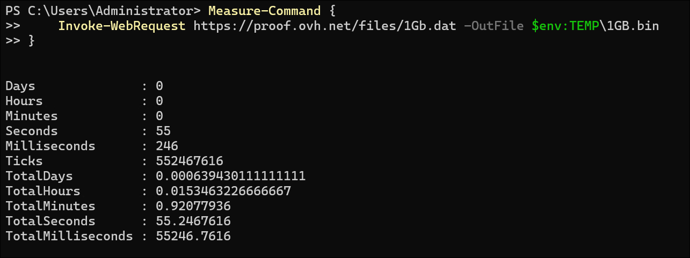
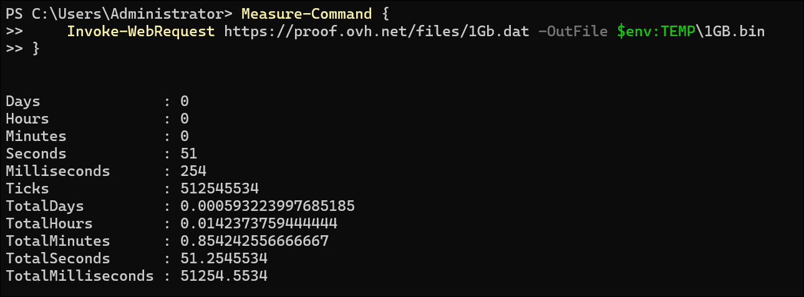
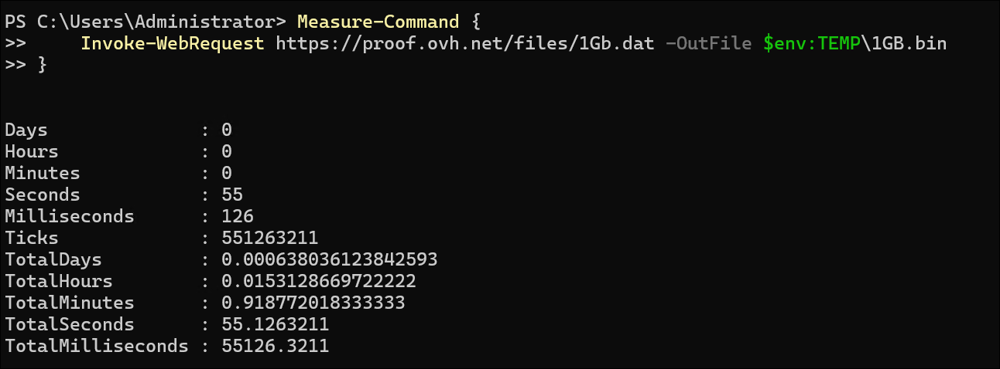

**LFBO Team**:
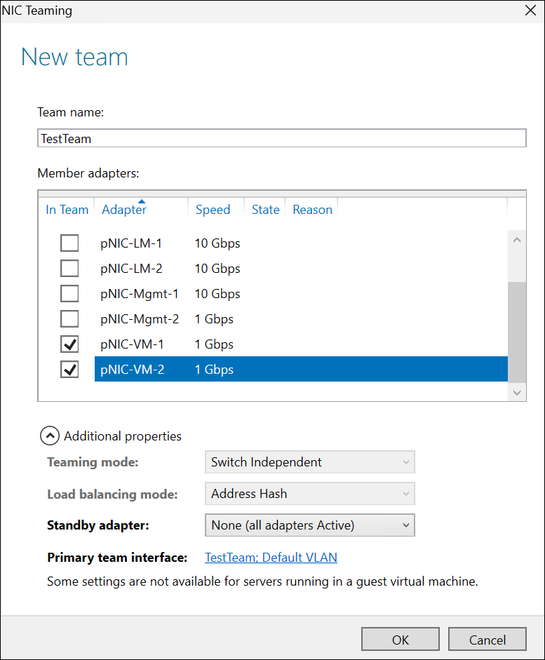
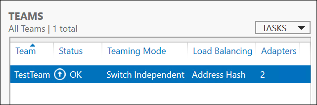

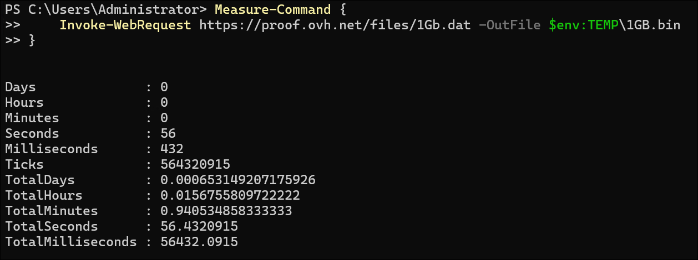
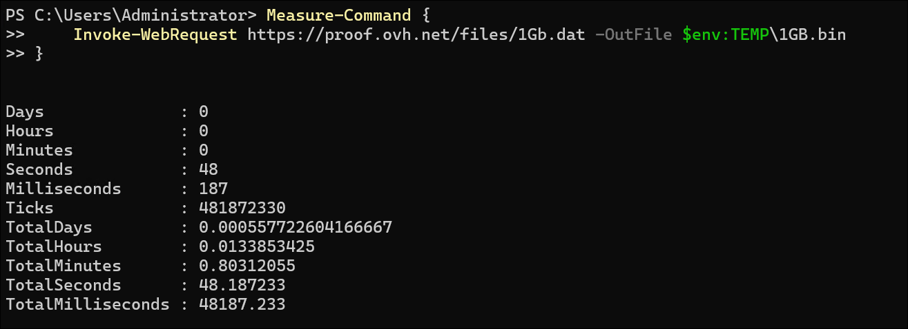


**SET Team**:
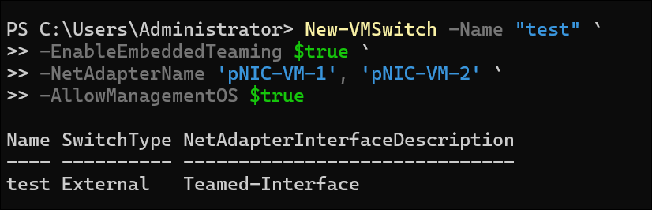
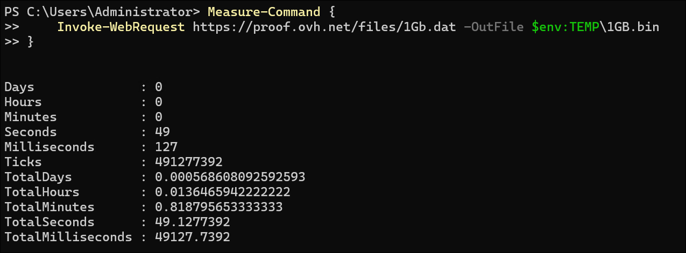
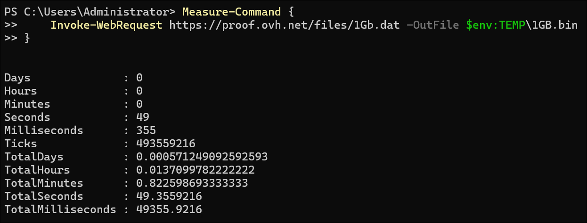
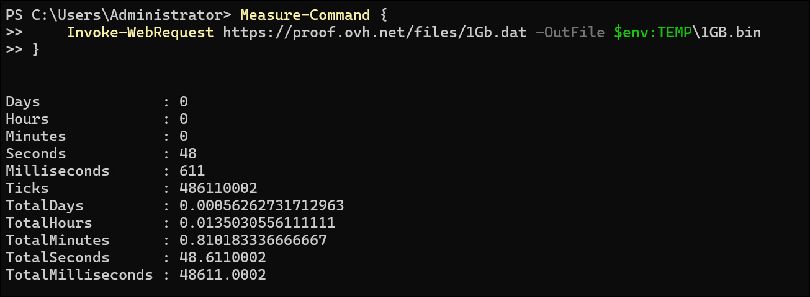
