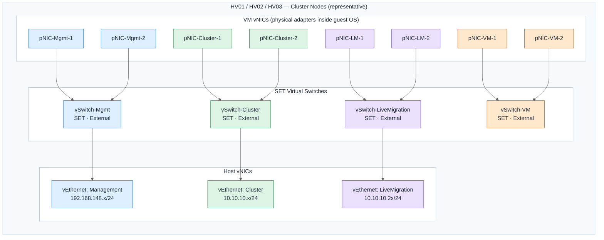
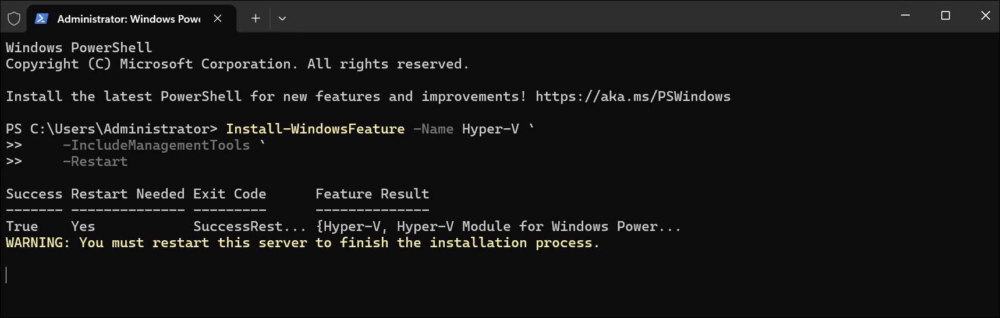
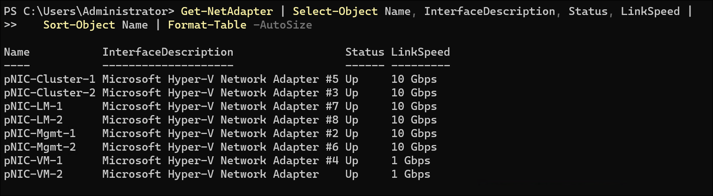
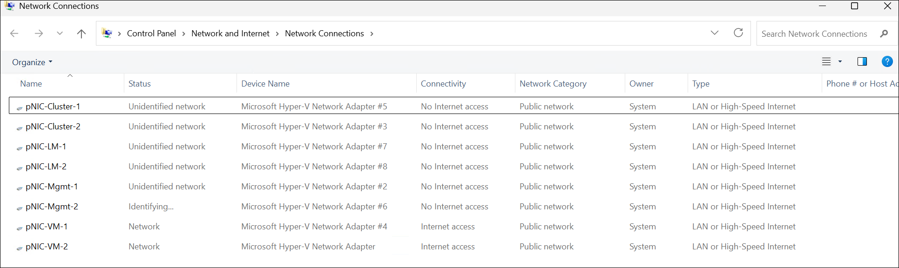
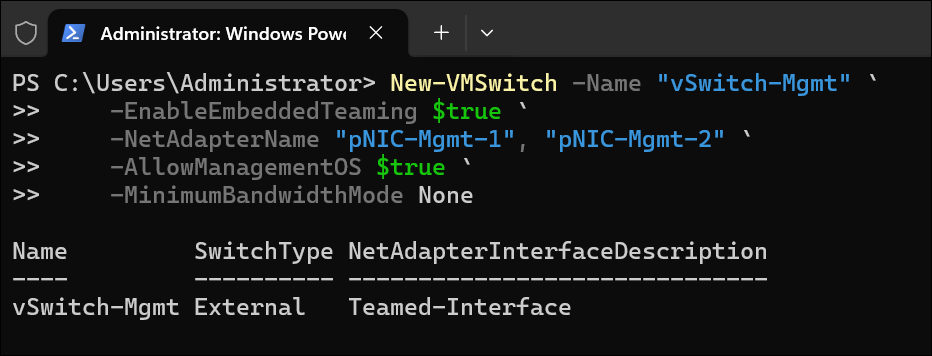
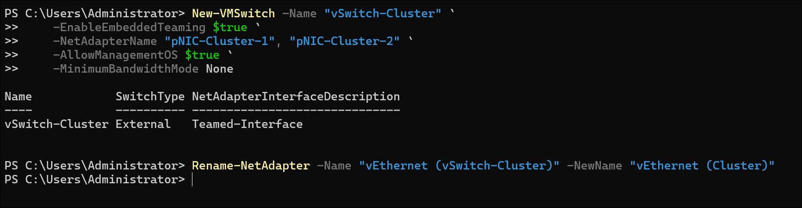
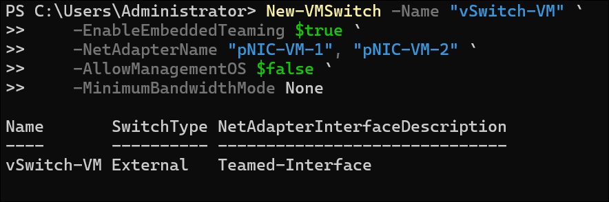
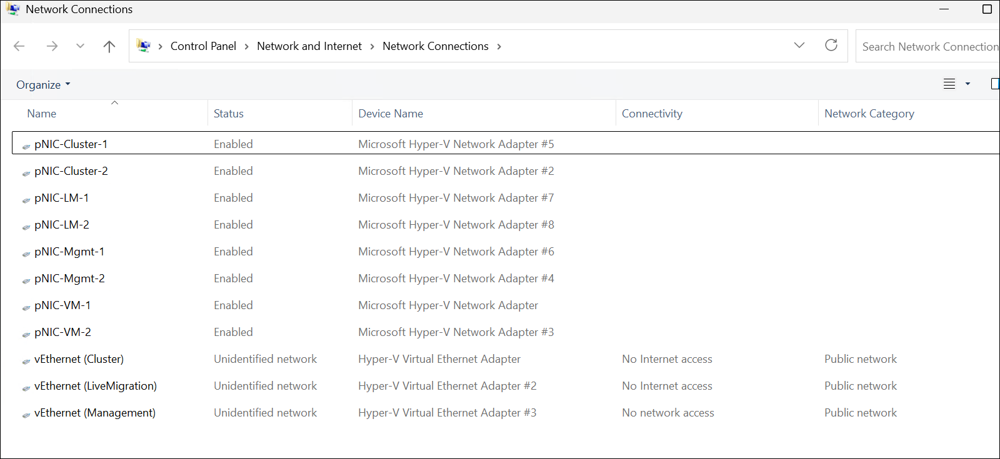
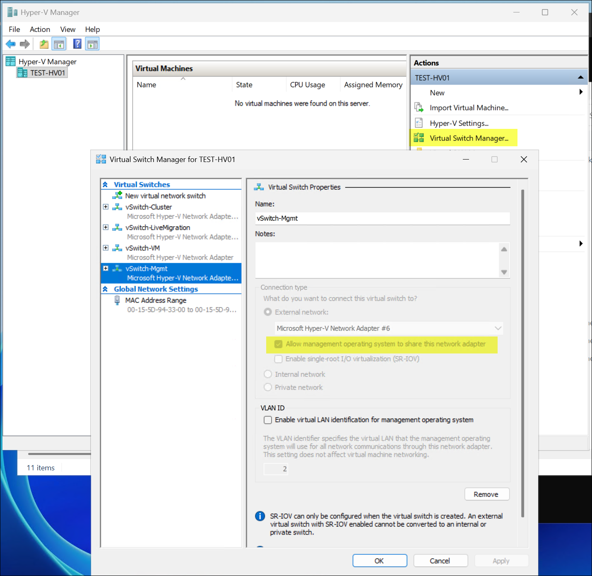

# Hyper-V Failover Cluster Lab Guide

This guide walks through the end-to-end process of building a **Windows Server 2025 Datacenter** Hyper-V failover cluster — from bare host configuration through to a fully operational cluster with Cluster Shared Volumes (CSV). It uses **Switch Embedded Teaming (SET)** for virtual switch configuration, which is the recommended approach for Windows Server 2025 Hyper-V deployments.

---

## Table of Contents

1. [Architecture Overview](#1-architecture-overview)
2. [Prerequisites](#2-prerequisites)
3. [Phase 1 — Host Configuration](#3-phase-1--host-configuration)
4. [Phase 2 — Install and Configure Hyper-V Role](#4-phase-2--install-and-configure-hyper-v-role)
5. [Phase 3 — Networking with SET Virtual Switches](#5-phase-3--networking-with-set-virtual-switches)
6. [Phase 4 — Storage Configuration](#6-phase-4--storage-configuration)
7. [Phase 5 — Active Directory Preparation](#7-phase-5--active-directory-preparation)
8. [Phase 6 — Failover Clustering](#8-phase-6--failover-clustering)
9. [Phase 7 — Cluster Shared Volumes](#9-phase-7--cluster-shared-volumes)
10. [Phase 8 — Configure Live Migration](#10-phase-8--configure-live-migration)
11. [Phase 9 — Validation and Testing](#11-phase-9--validation-and-testing)
12. [Appendix — PowerShell Quick Reference](#12-appendix--powershell-quick-reference)

---

## 1. Architecture Overview

This lab deploys a 3-node Hyper-V failover cluster with a dedicated domain controller, shared storage, and Active Directory.

| Component | Count | Specification |
|---|---|---|
| Cluster nodes | 3 | Gen 2, 4 vCPUs, 8 GB RAM (dynamic), 127 GB OS disk |
| Domain controller | 1 | Gen 2, 2 vCPUs, 4 GB RAM (dynamic), 127 GB OS disk |
| CSV shared disks | 2 | 100 GB fixed VHDX each |
| Witness disk | 1 | 5 GB fixed VHDX |

### Network Topology

The diagram below maps the NIC chain inside each cluster node guest OS, where VM vNICs act as physical adapters teamed into dedicated SET virtual switches.



### Network Design

Each cluster node uses **eight physical NICs** (or virtual NICs in a nested lab) organized into four SET teams:

| SET vSwitch | Member NICs | Traffic Type | Switch Type |
|---|---|---|---|
| `vSwitch-Mgmt` | pNIC-Mgmt-1, pNIC-Mgmt-2 | Host management, DNS, domain traffic | External |
| `vSwitch-Cluster` | pNIC-Cluster-1, pNIC-Cluster-2 | Cluster heartbeat, CSV I/O | External |
| `vSwitch-LiveMigration` | pNIC-LM-1, pNIC-LM-2 | Live migration traffic | External |
| `vSwitch-VM` | pNIC-VM-1, pNIC-VM-2 | VM guest network traffic | External |

### IP Addressing

| Network | Subnet | Purpose |
|---|---|---|
| Management | 192.168.148.0/24 | Host management, AD, DNS |
| Cluster | 10.10.10.0/24 | Cluster-internal communication |
| VM | DHCP or 192.168.1.0/24 | VM guest traffic |

> **Note**: In classic single-site/single-subnet cluster designs, the Cluster and Live Migration networks typically do not need to be routable beyond the local segment. If cluster nodes span subnets or sites, those networks must be routable between nodes.

### Host and Cluster Service IP Mapping

| Host / Service | Management IP | Cluster IP | Live Migration IP | Notes |
|---|---|---|---|---|
| `HV01` | 192.168.148.51 | 10.10.10.11 | 10.10.10.21 | Node 1 |
| `HV02` | 192.168.148.52 | 10.10.10.12 | 10.10.10.22 | Node 2 |
| `HV03` | 192.168.148.53 | 10.10.10.13 | 10.10.10.23 | Node 3 |
| `HV-Cluster` (cluster service name/IP) | 192.168.148.50 | N/A | N/A | Cluster client access point |

---

## 2. Prerequisites

- **Host OS**: Windows Server 2025 Datacenter (or Windows 11/Windows Server 2022 with Hyper-V for nested lab)
- **Hardware**: Minimum 32 GB RAM, 500 GB free disk, CPU with SLAT support
- **Software**: PowerShell 7+, Windows Server 2025 Datacenter ISO
- **Network**: NICs matching your vSwitch design (physical or nested virtual adapters)
- All cluster nodes must share the same Windows Server version and edition

---

## 3. Phase 1 — Host Configuration

Run the following on **each cluster node** after installing Windows Server 2025 Datacenter.

### 3.1 Set Computer Name

```powershell
Rename-Computer -NewName "HV01" -Restart
# Repeat for HV02, HV03
```

### 3.2 Configure Windows Update

```powershell
# Install all pending updates
Install-Module -Name PSWindowsUpdate -Force -Scope AllUsers
Import-Module PSWindowsUpdate
Get-WindowsUpdate -Install -AcceptAll -AutoReboot
```

### 3.3 Configure Remote Management

```powershell
# Enable remote desktop
Set-ItemProperty -Path 'HKLM:\System\CurrentControlSet\Control\Terminal Server' `
    -Name "fDenyTSConnections" -Value 0
Enable-NetFirewallRule -DisplayGroup "Remote Desktop"

# Enable PowerShell remoting
Enable-PSRemoting -Force
```

### 3.4 Configure Power Settings

```powershell
powercfg /setactive SCHEME_MIN  # High performance
```

---

## 4. Phase 2 — Install and Configure Hyper-V Role

### 4.1 Install the Hyper-V Role

```powershell
Install-WindowsFeature -Name Hyper-V `
    -IncludeManagementTools `
    -Restart
```



### 4.2 Configure Default Hyper-V Paths

```powershell
Set-VMHost -VirtualMachinePath "C:\Hyper-V" `
           -VirtualHardDiskPath "C:\Hyper-V"
```

> **Note**: This initial path is intended for early host setup. After Cluster Shared Volumes are configured in Phase 7, update both defaults to `C:\ClusterStorage\Volume1` in Step 9.5.

### 4.3 Configure Hyper-V Host Settings

```powershell
# Enable NUMA spanning (useful for VMs larger than a single NUMA node)
Set-VMHost -NumaSpanningEnabled $true

# Configure enhanced session mode
Set-VMHost -EnableEnhancedSessionMode $true

# Set live migration settings (configured fully in Phase 8)
Set-VMHost -MaximumVirtualMachineMigrations 2
```

---

## 5. Phase 3 — Networking with SET Virtual Switches

**Switch Embedded Teaming (SET)** is the replacement for traditional NIC Teaming (LBFO) in Hyper-V environments starting with Windows Server 2016. SET is integrated directly into the Hyper-V virtual switch, providing NIC teaming functionality without a separate LBFO team. In Windows Server 2025, SET is the recommended and fully supported approach.

### 5.1 Why SET Over Traditional NIC Teaming

| Feature | LBFO (Legacy) | SET (Recommended) |
|---|---|---|
| RDMA support | No | Yes |
| Hyper-V integration | Separate layer | Built into vSwitch |
| Max team members | 32 | 8 |
| SR-IOV compatible | No | Yes |
| Supported in WS2025 | Deprecated | Fully supported |
| Management plane | Separate | Unified with vSwitch |

### 5.2 Identify Physical Adapters

Before creating SET switches, identify the NICs on each node:

```powershell
$mapping = @{
    1 = "pNIC-Mgmt-1"
    2 = "pNIC-Mgmt-2"
    3 = "pNIC-Cluster-1"
    4 = "pNIC-Cluster-2"
    5 = "pNIC-LM-1"
    6 = "pNIC-LM-2"
    7 = "pNIC-VM-1"
    8 = "pNIC-VM-2"
}

$mapping.GetEnumerator() |
    Sort-Object Key |
    ForEach-Object {
        $adapter = Get-NetAdapter -InterfaceIndex $_.Key -ErrorAction SilentlyContinue
        if ($adapter -and $adapter.Name -ne $_.Value) {
            Rename-NetAdapter -InterfaceIndex $_.Key -NewName $_.Value
        }
    }

Get-NetAdapter | Select-Object InterfaceIndex, Name, InterfaceDescription, Status, LinkSpeed |
    Sort-Object InterfaceIndex | Format-Table -AutoSize
```





### 5.3 Create the Management SET vSwitch

```powershell
# Create an external SET vSwitch for management traffic
New-VMSwitch -Name "vSwitch-Mgmt" `
    -EnableEmbeddedTeaming $true `
    -NetAdapterName "pNIC-Mgmt-1", "pNIC-Mgmt-2" `
    -AllowManagementOS $true `
    -MinimumBandwidthMode None

# Rename the host vNIC created by New-VMSwitch to match naming convention
Rename-NetAdapter -Name "vEthernet (vSwitch-Mgmt)" -NewName "vEthernet (Management)"
```

> **Note**: The host will temporarily lose RDP connectivity (~30s) while the external virtual switch is created. During this process, network binding moves from the physical NIC to the new host virtual NIC (`vEthernet`), and the management IP configuration is carried over.



### 5.4 Create the Cluster SET vSwitch

```powershell
# Create an external SET vSwitch for cluster heartbeat and CSV traffic
New-VMSwitch -Name "vSwitch-Cluster" `
    -EnableEmbeddedTeaming $true `
    -NetAdapterName "pNIC-Cluster-1", "pNIC-Cluster-2" `
    -AllowManagementOS $true `
    -MinimumBandwidthMode None

# Rename the host vNIC created by New-VMSwitch to match naming convention
Rename-NetAdapter -Name "vEthernet (vSwitch-Cluster)" -NewName "vEthernet (Cluster)"
```



### 5.5 Create the Live Migration SET vSwitch

```powershell
# Create an external SET vSwitch for live migration traffic
New-VMSwitch -Name "vSwitch-LiveMigration" `
    -EnableEmbeddedTeaming $true `
    -NetAdapterName "pNIC-LM-1", "pNIC-LM-2" `
    -AllowManagementOS $true `
    -MinimumBandwidthMode None

# Rename the host vNIC created by New-VMSwitch to match naming convention
Rename-NetAdapter -Name "vEthernet (vSwitch-LiveMigration)" -NewName "vEthernet (LiveMigration)"
```


### 5.6 Create the VM SET vSwitch

```powershell
# Create an external SET vSwitch for VM guest traffic
New-VMSwitch -Name "vSwitch-VM" `
    -EnableEmbeddedTeaming $true `
    -NetAdapterName "pNIC-VM-1", "pNIC-VM-2" `
    -AllowManagementOS $false `
    -MinimumBandwidthMode None
```



> **Tip**: Set `-AllowManagementOS $false` on the VM vSwitch to keep host management traffic isolated from guest VM traffic.

Here's a look at all adapters after virtual switch creation:





### 5.7 Configure IP Addresses on Host vNICs

```powershell
# Cluster vNIC — adjust IP per node (HV01=.11, HV02=.12, HV03=.13)
New-NetIPAddress -InterfaceAlias "vEthernet (Cluster)" `
    -IPAddress "10.10.10.11" `
    -PrefixLength 24

# Live Migration vNIC — adjust IP per node (HV01=.21, HV02=.22, HV03=.23)
New-NetIPAddress -InterfaceAlias "vEthernet (LiveMigration)" `
    -IPAddress "10.10.10.21" `
    -PrefixLength 24
```

### 5.8 Configure SET Team Settings

```powershell
# View the SET team configuration
Get-VMSwitchTeam -Name "vSwitch-Mgmt"

# Set load balancing algorithm (HyperVPort is the default and recommended)
Set-VMSwitchTeam -Name "vSwitch-Mgmt" -LoadBalancingAlgorithm HyperVPort
Set-VMSwitchTeam -Name "vSwitch-Cluster" -LoadBalancingAlgorithm HyperVPort
Set-VMSwitchTeam -Name "vSwitch-LiveMigration" -LoadBalancingAlgorithm HyperVPort
Set-VMSwitchTeam -Name "vSwitch-VM" -LoadBalancingAlgorithm HyperVPort
```

### 5.9 Configure QoS Policies (Optional)

```powershell
# Reserve bandwidth for cluster heartbeat traffic
New-NetQosPolicy -Name "Cluster" -IPDstPortStart 3343 -IPDstPortEnd 3343 `
    -IPProtocol UDP -NetworkProfile All -MinBandwidthWeightAction 30

# Reserve bandwidth for live migration traffic
New-NetQosPolicy -Name "LiveMigration" -LiveMigration -MinBandwidthWeightAction 40

# Reserve bandwidth for SMB (CSV) traffic
New-NetQosPolicy -Name "SMB" -NetDirectPortMatchCondition 445 `
    -MinBandwidthWeightAction 30
```

### 5.10 Verify SET Configuration

```powershell
# Verify all SET switches
Get-VMSwitch | Select-Object Name, SwitchType, EmbeddedTeamingEnabled |
    Format-Table -AutoSize

# Verify team members
Get-VMSwitch | ForEach-Object {
    Write-Host "`n=== $($_.Name) ===" -ForegroundColor Cyan
    Get-VMSwitchTeam -Name $_.Name | Select-Object -ExpandProperty NetAdapterInterfaceDescription
}

# Verify host vNICs
Get-VMNetworkAdapter -ManagementOS | Select-Object Name, SwitchName, IPAddresses |
    Format-Table -AutoSize

# Verify connectivity - ping from each node
Test-NetConnection -ComputerName "192.168.148.52" -InformationLevel Detailed
Test-NetConnection -ComputerName "10.10.10.12" -InformationLevel Detailed
```

---

## 6. Phase 4 — Storage Configuration

### 6.1 Prepare Shared Storage

For a physical cluster, shared storage is typically provided by an iSCSI target, Fibre Channel SAN, or Storage Spaces Direct (S2D). In this nested lab, you can use either shared VHDX disks or SMB file shares.

> **SMB Alternative**: For an SMB-based approach that uses a file share on the domain controller instead of shared VHDX disks, see the [SMB Shared Storage Setup](smb-shared-storage-setup.md) walkthrough. If using SMB storage, skip the remainder of this section and proceed to [Phase 5 — Active Directory Preparation](#7-phase-5--active-directory-preparation).

#### Initialize Shared Disks (on the first node only)

```powershell
# List raw disks
Get-Disk | Where-Object PartitionStyle -eq 'RAW' |
    Select-Object Number, Size, FriendlyName | Format-Table -AutoSize

# Initialize and format CSV disks
$csvDisks = Get-Disk | Where-Object { $_.PartitionStyle -eq 'RAW' -and $_.Size -gt 50GB }
foreach ($disk in $csvDisks) {
    Initialize-Disk -Number $disk.Number -PartitionStyle GPT
    New-Partition -DiskNumber $disk.Number -UseMaximumSize -AssignDriveLetter |
        Format-Volume -FileSystem NTFS -NewFileSystemLabel "CSV-Disk-$($disk.Number)" -Confirm:$false
}

# Initialize and format witness disk
$witnessDisk = Get-Disk | Where-Object { $_.PartitionStyle -eq 'RAW' -and $_.Size -le 10GB }
Initialize-Disk -Number $witnessDisk.Number -PartitionStyle GPT
New-Partition -DiskNumber $witnessDisk.Number -UseMaximumSize -AssignDriveLetter |
    Format-Volume -FileSystem NTFS -NewFileSystemLabel "Witness" -Confirm:$false
```

### 6.2 Bring Disks Online on All Nodes

```powershell
# On each remaining node, bring shared disks online
Get-Disk | Where-Object IsOffline | Set-Disk -IsOffline $false
Get-Disk | Where-Object IsReadOnly | Set-Disk -IsReadOnly $false
```

### 6.3 Configure SAN Policy

```powershell
# Set SAN policy to bring shared disks online automatically
Set-StorageSetting -NewDiskPolicy OnlineAll
```

---

## 7. Phase 5 — Active Directory Preparation

A single-forest Active Directory domain is required for failover clustering.

### 7.1 Promote the Domain Controller

On the dedicated domain controller VM (`TEST-DC01`):

```powershell
# Install AD DS role
Install-WindowsFeature -Name AD-Domain-Services -IncludeManagementTools

# Configure static IP
New-NetIPAddress -InterfaceAlias "Ethernet" `
    -IPAddress "192.168.148.10" `
    -PrefixLength 24

Set-DnsClientServerAddress -InterfaceAlias "Ethernet" `
    -ServerAddresses "127.0.0.1", "192.168.148.10"

# Promote to domain controller
Import-Module ADDSDeployment

$safeModePassword = Read-Host -Prompt "Enter DSRM password" -AsSecureString

Install-ADDSForest `
    -DomainName "test.lab" `
    -InstallDns `
    -SafeModeAdministratorPassword $safeModePassword `
    -Force
```

### 7.2 Verify AD Services

```powershell
# After reboot, verify AD DS is running
Get-Service NTDS, DNS | Select-Object Name, Status
Get-ADDomain | Select-Object DnsRoot, Forest, DomainMode
```

### 7.3 Join Cluster Nodes to the Domain

On **each cluster node**:

```powershell
# Point DNS to domain controller
Get-NetAdapter | Where-Object Status -eq 'Up' | ForEach-Object {
    Set-DnsClientServerAddress -InterfaceIndex $_.ifIndex `
    -ServerAddresses "192.168.148.10"
}

# Join the domain
$credential = Get-Credential -Message "Enter domain admin credentials (Administrator@test.lab)"
Add-Computer -DomainName "test.lab" -Credential $credential -Restart
```

### 7.4 Create a Cluster Service Account (Optional)

On the domain controller:

```powershell
# Create a dedicated service account for the cluster
New-ADUser -Name "svc-cluster" `
    -SamAccountName "svc-cluster" `
    -UserPrincipalName "svc-cluster@test.lab" `
    -AccountPassword (ConvertTo-SecureString "ClusterP@ss2025!" -AsPlainText -Force) `
    -Enabled $true `
    -PasswordNeverExpires $true

# Add to Domain Admins for lab simplicity (tighten for production)
Add-ADGroupMember -Identity "Domain Admins" -Members "svc-cluster"
```

---

## 8. Phase 6 — Failover Clustering

### 8.1 Install the Failover Clustering Feature

On **each cluster node**:

```powershell
Install-WindowsFeature -Name Failover-Clustering `
    -IncludeManagementTools `
    -Restart
```

### 8.2 Validate the Cluster Configuration

Run from **any one node** (validation tests all specified nodes):

```powershell
Test-Cluster -Node "HV01", "HV02", "HV03" -Include "Storage", "Inventory", "Network", "System Configuration"
```

Review the validation report carefully. Address any warnings or errors before proceeding. The report is saved to `C:\Windows\Cluster\Reports` by default.

### 8.3 Create the Failover Cluster

```powershell
New-Cluster -Name "HV-Cluster" `
    -Node "HV01", "HV02", "HV03" `
    -StaticAddress "192.168.148.50" `
    -NoStorage
```

> **Note**: Use `-NoStorage` to create the cluster without automatically adding eligible disks. Storage is added explicitly in the next phase.

### 8.4 Verify Cluster Formation

```powershell
Get-Cluster | Select-Object Name, Domain
Get-ClusterNode | Select-Object Name, State, DynamicWeight
Get-ClusterNetwork | Select-Object Name, Role, Address | Format-Table -AutoSize
```

### 8.5 Configure Cluster Networks

After cluster creation, rename and configure the cluster networks for clarity:

```powershell
# Rename cluster networks
(Get-ClusterNetwork | Where-Object Address -eq "192.168.148.0").Name = "Management"
(Get-ClusterNetwork | Where-Object Address -eq "10.10.10.0").Name = "Cluster"

# Set network roles
# 0 = Not used by cluster, 1 = Cluster only, 3 = Cluster and client
(Get-ClusterNetwork "Management").Role = 3
(Get-ClusterNetwork "Cluster").Role = 1
```

---

## 9. Phase 7 — Cluster Shared Volumes

### 9.1 Add Disks to the Cluster

```powershell
# Add all available shared disks to the cluster
Get-ClusterAvailableDisk | Add-ClusterDisk
```

### 9.2 Convert Data Disks to CSV

```powershell
# List cluster disks
Get-ClusterResource | Where-Object ResourceType -eq "Physical Disk" |
    Select-Object Name, State, OwnerGroup | Format-Table -AutoSize

# Convert the two data disks to Cluster Shared Volumes
Add-ClusterSharedVolume -Name "Cluster Disk 1"
Add-ClusterSharedVolume -Name "Cluster Disk 2"
```

CSV volumes are mounted at `C:\ClusterStorage\Volume1` and `C:\ClusterStorage\Volume2` on all nodes simultaneously.

### 9.3 Configure the Witness Disk

```powershell
# Set disk witness quorum
Set-ClusterQuorum -DiskWitness "Cluster Disk 3"

# Verify quorum configuration
Get-ClusterQuorum | Select-Object Cluster, QuorumResource, QuorumType
```

### 9.4 Verify CSV Health

```powershell
Get-ClusterSharedVolume | Select-Object Name, State, OwnerNode |
    Format-Table -AutoSize

# Verify CSV paths are accessible on all nodes
Invoke-Command -ComputerName "HV01", "HV02", "HV03" -ScriptBlock {
    Test-Path "C:\ClusterStorage\Volume1"
}
```

### 9.5 Update Default Hyper-V Paths to CSV

After CSV is online, point the default VM and VHDX paths to the shared volume on each cluster node:

```powershell
Set-VMHost -VirtualMachinePath "C:\ClusterStorage\Volume1" `
           -VirtualHardDiskPath "C:\ClusterStorage\Volume1"
```

---

## 10. Phase 8 — Configure Live Migration

### 10.1 Enable Live Migration

```powershell
# Enable live migration on all cluster nodes
Invoke-Command -ComputerName "HV01", "HV02", "HV03" -ScriptBlock {
    Enable-VMMigration
}
```

### 10.2 Configure Live Migration Networks

```powershell
# Restrict live migration to the cluster network
Invoke-Command -ComputerName "HV01", "HV02", "HV03" -ScriptBlock {
    # Set migration to use specific subnet
    Set-VMHost -VirtualMachineMigrationPerformanceOption SMB

    # Add the cluster network for live migration
    Add-VMMigrationNetwork -Subnet "10.10.10.0/24" -Priority 1

    # Remove management network from migration (if present)
    $mgmtNet = Get-VMMigrationNetwork | Where-Object Subnet -like "192.168.148.*"
    if ($mgmtNet) {
        Remove-VMMigrationNetwork -Subnet $mgmtNet.Subnet
    }
}
```

### 10.3 Configure Live Migration Authentication

```powershell
# Configure Kerberos authentication for live migration (recommended)
Invoke-Command -ComputerName "HV01", "HV02", "HV03" -ScriptBlock {
    Set-VMHost -VirtualMachineMigrationAuthenticationType Kerberos
}
```

For Kerberos live migration, configure constrained delegation on each cluster node's computer account in Active Directory:

```powershell
# Run on the domain controller — configure delegation for each node pair
$nodes = "HV01$", "HV02$", "HV03$"
foreach ($source in $nodes) {
    foreach ($target in $nodes) {
        if ($source -ne $target) {
            $targetFqdn = ($target -replace '\$$', '') + ".test.lab"
            Set-ADComputer -Identity $source -Add @{
                'msDS-AllowedToDelegateTo' = @(
                    "Microsoft Virtual System Migration Service/$targetFqdn",
                    "cifs/$targetFqdn"
                )
            }
        }
    }
}
```

### 10.4 Test Live Migration

```powershell
# Create a test VM and migrate it
New-VM -Name "TestVM" -MemoryStartupBytes 512MB -NewVHDPath "C:\ClusterStorage\Volume1\TestVM\TestVM.vhdx" -NewVHDSizeBytes 20GB -Generation 2

# Add to cluster
Add-ClusterVirtualMachineRole -VMName "TestVM"

# Perform live migration
Move-ClusterVirtualMachineRole -Name "TestVM" -Node "HV02" -MigrationType Live
```

---

## 11. Phase 9 — Validation and Testing

### 11.1 Full Cluster Validation

```powershell
# Run full validation suite
Test-Cluster -Node "HV01", "HV02", "HV03"
```

### 11.2 Verify Cluster Health

```powershell
# Cluster overview
Get-Cluster | Format-List *

# Node status
Get-ClusterNode | Format-Table Name, State, DynamicWeight -AutoSize

# Network status
Get-ClusterNetwork | Format-Table Name, State, Role -AutoSize

# CSV status
Get-ClusterSharedVolume | Format-Table Name, State, OwnerNode -AutoSize

# Quorum status
Get-ClusterQuorum
```

### 11.3 Test Failover

```powershell
# Simulate node failure by stopping cluster service
Stop-ClusterNode -Name "HV01"

# Verify VMs migrated
Get-ClusterGroup | Format-Table Name, State, OwnerNode -AutoSize

# Bring node back
Start-ClusterNode -Name "HV01"
```

### 11.4 Verify SET vSwitch Redundancy

```powershell
# Check SET team status across all nodes
Invoke-Command -ComputerName "HV01", "HV02", "HV03" -ScriptBlock {
    Get-VMSwitch | Where-Object EmbeddedTeamingEnabled | ForEach-Object {
        [PSCustomObject]@{
            Node       = $env:COMPUTERNAME
            Switch     = $_.Name
            TeamStatus = (Get-VMSwitchTeam -Name $_.Name).TeamingMode
            Members    = ((Get-VMSwitchTeam -Name $_.Name).NetAdapterInterfaceDescription -join ', ')
        }
    }
} | Format-Table -AutoSize
```

---

## 12. Appendix — PowerShell Quick Reference

### SET vSwitch Management

```powershell
# List all SET switches
Get-VMSwitch | Where-Object EmbeddedTeamingEnabled | Format-Table Name, SwitchType

# Add a NIC to an existing SET team
Set-VMSwitchTeam -Name "vSwitch-Mgmt" -NetAdapterName "pNIC-Mgmt-1", "pNIC-Mgmt-2", "pNIC-Mgmt-3"

# Remove a NIC from a SET team (specify remaining members)
Set-VMSwitchTeam -Name "vSwitch-Mgmt" -NetAdapterName "pNIC-Mgmt-1", "pNIC-Mgmt-2"

# Change load balancing algorithm
Set-VMSwitchTeam -Name "vSwitch-Mgmt" -LoadBalancingAlgorithm Dynamic

# View team details
Get-VMSwitchTeam | Format-List *
```

### Cluster Quick Commands

```powershell
# Create a highly available VM
New-VM -Name "ProdVM01" -MemoryStartupBytes 4GB `
    -NewVHDPath "C:\ClusterStorage\Volume1\ProdVM01\ProdVM01.vhdx" `
    -NewVHDSizeBytes 100GB -Generation 2
Add-ClusterVirtualMachineRole -VMName "ProdVM01"

# Drain a node for maintenance
Suspend-ClusterNode -Name "HV01" -Drain

# Resume a node
Resume-ClusterNode -Name "HV01"

# Move all roles off a node
Get-ClusterGroup | Where-Object OwnerNode -eq "HV01" |
    Move-ClusterGroup -Node "HV02"
```

### Useful Diagnostic Commands

```powershell
# Cluster log
Get-ClusterLog -Destination "C:\Temp" -TimeSpan 60

# Cluster events
Get-WinEvent -LogName "Microsoft-Windows-FailoverClustering/Operational" -MaxEvents 50

# Network connectivity matrix
$nodes = "HV01", "HV02", "HV03"
foreach ($node in $nodes) {
    foreach ($target in $nodes) {
        if ($node -ne $target) {
            $result = Invoke-Command -ComputerName $node -ScriptBlock {
                Test-NetConnection -ComputerName $using:target -Port 445
            }
            Write-Host "$node -> $target : $($result.TcpTestSucceeded)"
        }
    }
}
```

---

## Related Guides

- [Network ATC Implementation Guide](network-atc-implementation-guide.md) — Simplified networking using Network ATC intent-based configuration
